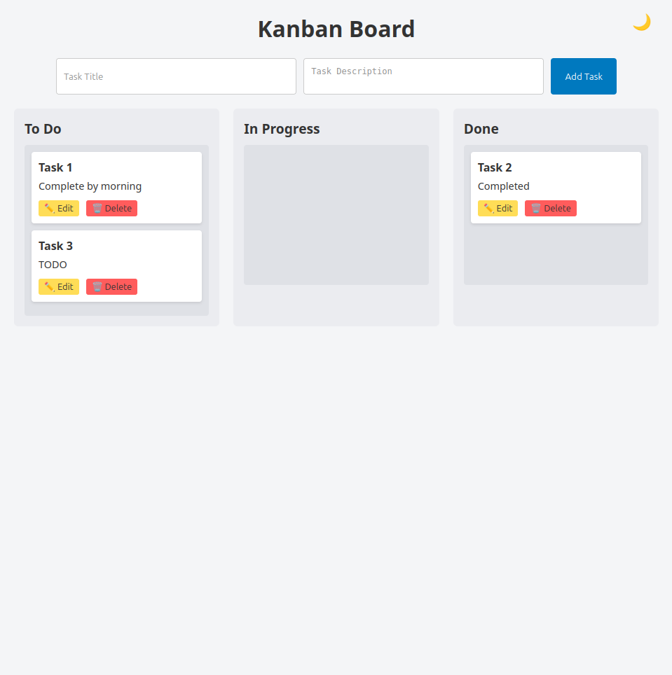
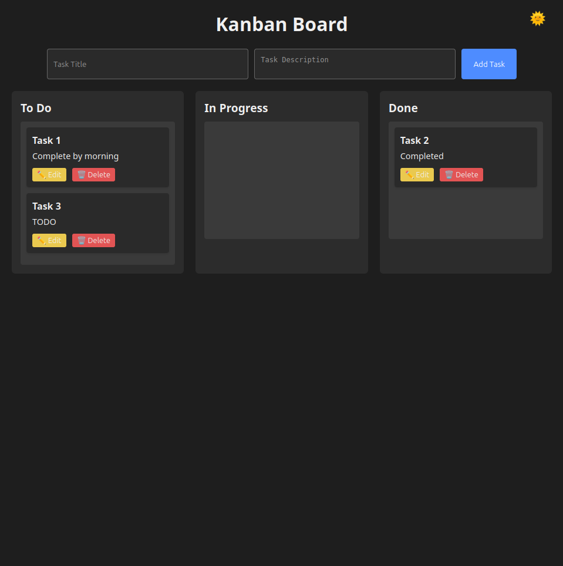

# 🗂️ Frontend Kanban Board – Task Submission

A clean, modular **Kanban board** built using **vanilla JavaScript**, **HTML**, and **CSS** — with features like:

- ✅ Task creation
- ✅ Inline editing with Save/Cancel
- ✅ Task deletion
- ✅ Drag-and-drop between columns
- ✅ Persistent state with `localStorage`
- ✅ 🌙 **Light/Dark Mode toggle**

---

## 📸 Screenshot

**Light Mode:**  


**Dark Mode:**  


---

## 🛠️ Features

| Feature               | Status | Notes                                     |
|----------------------|--------|-------------------------------------------|
| Add Task             | ✅     | Title & description via form              |
| Edit Task Inline     | ✅     | In-place editing with Save/Cancel         |
| Delete Task          | ✅     | Deletes with UI update                    |
| Drag and Drop        | ✅     | Reorganize tasks across columns           |
| Persistent Storage   | ✅     | Uses `localStorage`                       |
| Reusable Utilities   | ✅     | DOM + ID helpers in `utils.js`            |
| Modular Codebase     | ✅     | Logic split into separate JS modules      |
| Light/Dark Mode      | ✅     | Toggle switch with saved theme preference |

---

## 🗂️ Folder Structure

```
project-root/
│
├── index.html          # HTML layout (form + board)
├── styles.css          # Theme-aware CSS with dark mode
│
└── js/
    ├── main.js         # App entry – init + bootstrapping
    ├── ui.js           # Renders UI (cards, columns)
    ├── storage.js      # All localStorage operations
    ├── events.js       # Form + drag/drop + edit listeners
    └── utils.js        # Reusable functions (createElement, ID)
```

---

## 🔁 Execution Flow

1. **On Load**
   - Tasks loaded from `localStorage`
   - UI rendered via `renderTasks()`
   - Light/dark theme applied from localStorage (if any)

2. **User Actions**
   - `Add`: Creates a new task and re-renders UI
   - `Edit`: Replaces card content with inline form
   - `Delete`: Removes task and updates storage/UI
   - `Drag & Drop`: Updates task column status
   - `Toggle Theme`: Applies `.dark` class to body and saves preference

---

## 🎨 Light/Dark Mode

- Toggle 🌞/🌙 icon in top-right corner
- Theme is stored in `localStorage`
- Theme applies on next visit
- Built using CSS variables and a `.dark` class

---

## 🔧 Tech Stack

- **HTML5** – semantic layout
- **CSS3** – variables + flexbox + dark mode
- **JavaScript (ES6)** – modules, DOM, localStorage

---

## ✅ What’s Included

- [x] Add/Edit/Delete tasks
- [x] Move tasks between columns
- [x] localStorage support
- [x] Code modularity
- [x] Reusable utility functions
- [x] Clean, accessible UI
- [x] Light/Dark mode toggle

---

## 🚀 How to Run

1. Clone/download the project
2. Open `index.html` in your browser
3. Start adding and managing tasks!
